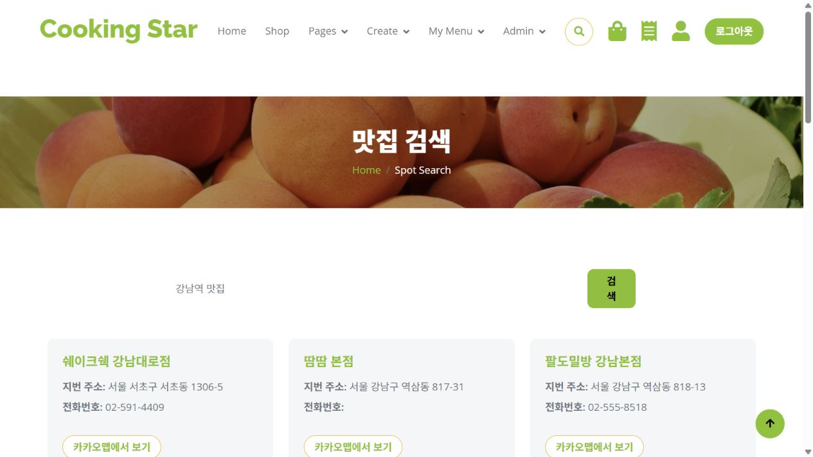
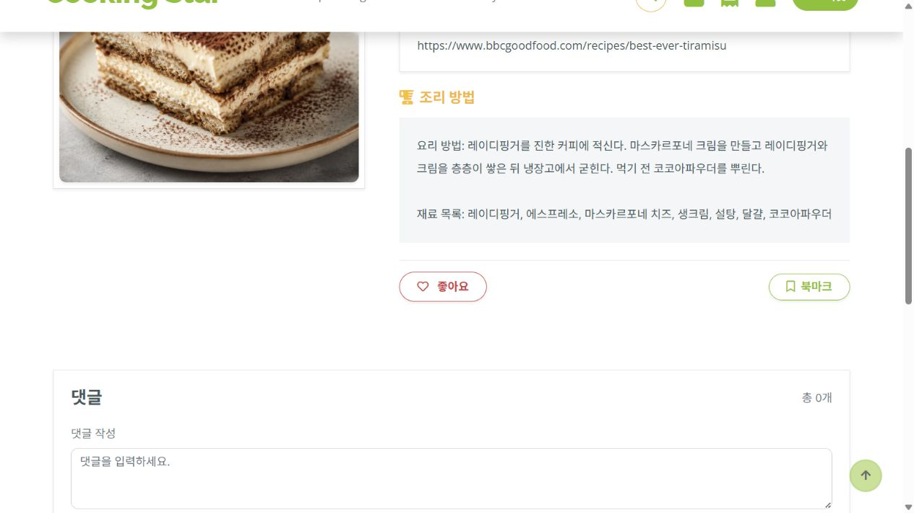

# Cooking Star

> 레시피를 조회하는 데서 끝나지 않고, 요리 기록·커뮤니티·외부 검색·구매 흐름을 한 서비스로 연결한 JSP 기반 요리 커뮤니티

Java 21 · Spring Boot 3.5 · Spring Security · MyBatis · PostgreSQL · JSP/JSTL · Ajax

2인 팀 프로젝트에서 회원 인증/인가, 댓글·레시피 좋아요·북마크·팔로우, Kakao Local·Naver Blog, 관리자·방문 집계를 담당했고, 요리 기록 게시판은 공동 구현했습니다. Naver Shopping·장바구니·구매내역·Gemini·레시피 파일 처리는 팀원이 담당했습니다.

## 프로젝트 한눈에 보기

| 항목 | 내용 |
| --- | --- |
| 개발 기간 | 2026.05.08 ~ 2026.05.26 |
| 인원 | 2인 |
| 형태 | Spring MVC 기반 웹 서비스 · Gradle WAR |
| 핵심 흐름 | 레시피 작성 → 요리 기록 → 댓글/좋아요/북마크/팔로우 → 검색·장바구니 |
| 인증 | Spring Security 세션 인증, remember-me, `ROLE_MEMBER`/`ROLE_MANAGER`/`ROLE_ADMIN` |
| 저장소 | PostgreSQL |

## 서비스 화면

| Kakao Local 기반 맛집 검색 | 레시피 상세의 커뮤니티 상호작용 |
| --- | --- |
|  |  |

맛집 검색 결과를 화면에 가공해 보여 주고 저장 흐름으로 연결했습니다. 레시피 상세에서는 좋아요·북마크·댓글 기능을 Ajax 및 사용자별 저장 상태와 연동했습니다.

### 이 프로젝트에서 보여주는 것

- 세션 기반 인증과 URL·역할별 접근 제어를 Spring Security 설정으로 분리
- `Principal`과 SQL 소유자 조건을 함께 사용해 수정·삭제 권한 검증
- PostgreSQL `ON CONFLICT`로 세션별 일일 방문 중복 기록 방지
- Naver Blog·Kakao Local API 결과를 서비스 데이터와 연결해 검색·저장 흐름 구현
- 방문자·회원·레시피 현황을 관리자 화면에서 집계

## 프로젝트 소개

Cooking Star는 사용자가 레시피와 직접 만든 요리 기록을 등록하고, 다른 사용자의 콘텐츠에 댓글·좋아요·북마크·팔로우로 반응할 수 있는 요리 커뮤니티입니다. 네이버 블로그·쇼핑 검색과 카카오 로컬 검색을 화면 안으로 연결해 레시피 탐색, 재료·상품 확인, 주변 맛집 저장까지 이어지는 사용 흐름을 구성했습니다.

초기 프로젝트인 만큼 JSP와 세션 인증을 선택했습니다. 제가 담당한 범위에서는 소유자 검증, Naver Blog·Kakao Local 응답 가공, 방문자 집계를 서비스 흐름에 연결했습니다.

## 역할 분담

저는 다음 영역을 맡았습니다.

회원가입·로그인·로그아웃, BCrypt, remember-me, URL·역할별 인가

댓글·레시피 좋아요·북마크·팔로우와 소유자 조건을 포함한 수정·삭제

Naver Blog Search와 Kakao Local 검색·저장

방문자 기록과 관리자 통계

요리 기록 게시판은 팀원과 공동으로 구현했습니다.

팀원은 레시피 게시판의 주요 CRUD와 파일 처리, Naver Shopping, 장바구니·구매내역, 요리 기록 좋아요, Gemini 연동을 맡았습니다.

## 기술 스택

| 구분 | 기술 |
| --- | --- |
| Language | Java 21 |
| Backend | Spring Boot 3.5.14, Spring MVC, Spring Security |
| Persistence | MyBatis 3.0.5, XML Mapper |
| Database | PostgreSQL |
| View | JSP, JSTL, Spring Security Taglibs |
| Interaction | JavaScript, Ajax, Bootstrap |
| Build | Gradle, WAR |
| External API | Naver Blog/Shopping Search, Kakao Local |

## 아키텍처

```text
Browser (JSP / Ajax)
        │  Session Cookie / Form / JSON
        ▼
Spring Security Filter Chain
        │  URL + ROLE + remember-me
        ▼
Controller (MVC / @ResponseBody)
        ▼
Service (@Transactional, business rule, file flow)
        ├──────────────► RestTemplate ──► Naver / Kakao
        ▼
MyBatis Mapper XML
        ▼
PostgreSQL

Every request ──► VisitInterceptor ──► COOK_VISIT (daily/session deduplication)
Admin pages ───► member / recipe / visit / order aggregate queries
```

`src/main/java/com/cooking/star` 아래 도메인별 패키지를 두고 DTO, Controller, Service, Mapper를 분리했습니다. JSP는 서버 렌더링을 담당하고, 좋아요·팔로우·장바구니 수량 같은 즉시 반영이 필요한 기능은 Ajax로 처리합니다.

## 주요 기능

아래는 팀 전체 구현 범위입니다. 개인 담당 범위는 위의 역할 분담을 기준으로 구분했습니다.

### 회원 · 인증 · 인가

- 회원가입 시 `BCryptPasswordEncoder`로 비밀번호 해시 저장
- Spring Security Form Login 기반 로그인·로그아웃
- `rememberMe` 파라미터와 7일 토큰 유효기간을 사용하는 remember-me
- 회원가입 시 기본 `ROLE_MEMBER` 부여
- 공개 URL, 로그인 필요 URL, 관리자 URL을 `requestMatchers`로 구분
- `ROLE_MANAGER`는 레시피·게시글 관리, `ROLE_ADMIN`은 회원 관리·권한 변경·전체 관리자 기능 접근

### 레시피 · 요리 기록

- 레시피 작성·목록·상세·수정·삭제
- 다중 이미지 업로드, 기존 파일 삭제, 새 이미지 추가
- 나만의 요리 기록 작성·수정·삭제
- 요리 기록은 최소 1장의 이미지, 수정 시 최대 5장 규칙 검증
- 상세 조회수와 최근 본 레시피 처리

### 커뮤니티 상호작용

- 댓글 작성·삭제: 댓글 작성자만 삭제 조건에 포함
- 레시피·요리 기록 좋아요 토글과 Ajax 화면 반영
- 북마크: 본인 레시피 북마크 차단, 중복 여부 조회
- 팔로우/언팔로우: 팔로워·팔로잉 관계 관리와 자기 자신 팔로우 방지
- 마이페이지에서 팔로워·팔로잉·북마크·내 레시피 집계

### 검색 · 장바구니 · 관리자

- 네이버 블로그 검색: 검색 결과를 JSON으로 받아 화면에 표시하고 링크 저장
- 네이버 쇼핑 검색: 상품명·최저가·이미지를 `CartDTO`로 변환해 장바구니와 연결
- 카카오 로컬 검색: 주변 맛집 검색, `MY_SPOT` 저장·삭제
- 장바구니 수량 수정·삭제와 구매내역 저장 흐름
- 관리자 대시보드: 전체 회원 수, 레시피 수, 오늘 방문자 수, 역할별 관리

## 인증 · 인가

`SecurityConfig`에서 세션 인증 흐름과 URL 권한을 한 곳에서 관리했습니다.

```text
Login Form
   ↓
Spring Security Form Login
   ↓
HttpSession + Principal
   ↓
Controller / Service
```

권한 모델은 다음과 같습니다.

| 대상 | 예시 |
| --- | --- |
| 공개 | `/`, 로그인·회원가입, 레시피/요리 기록 공개 목록·상세, 검색 |
| `ROLE_MEMBER` | 마이페이지, 레시피·요리 기록 작성/수정/삭제, 댓글, 좋아요, 북마크, 팔로우, 장바구니 |
| `ROLE_MANAGER` | 관리자 대시보드·레시피 관리 및 부적절 콘텐츠 삭제 |
| `ROLE_ADMIN` | 회원 목록, 역할 변경, 전체 `/admin/**` |

> 현재 구현은 서버 세션을 사용하는 초기 구조입니다. CSRF는 `SecurityConfig`에서 비활성화되어 있어 운영 수준의 보안 설정으로는 보완이 필요합니다.

## MyBatis · PostgreSQL 설계 포인트

### 계층 분리와 동적 SQL

Controller는 요청·응답과 로그인 사용자 식별을 담당하고, Service는 파일·트랜잭션·비즈니스 규칙을 조합합니다. SQL은 도메인별 XML Mapper에 분리해 `JOIN`, 동적 검색 조건, 페이지네이션, 집계 쿼리를 명시적으로 관리했습니다.

### 방문자 중복과 `ON CONFLICT`

`VisitInterceptor`는 정적 리소스를 제외한 요청마다 `VisitService`를 호출합니다. 서비스는 세션에 날짜별 방문 키를 저장하고, PostgreSQL 유니크 제약을 함께 사용합니다.

```sql
INSERT INTO "COOK_VISIT"
VALUES (default, (now() AT TIME ZONE 'Asia/Seoul')::date, #{sessionId})
ON CONFLICT ("VISIT_DATE", "SESSION_ID") DO NOTHING
```

애플리케이션의 세션 체크와 DB의 중복 무시를 겹쳐 적용해 같은 세션이 같은 날 여러 번 카운트되는 것을 막았습니다. `Advice`는 오늘 방문자 수와 전체 회원 수를 모든 JSP 화면에 공통 모델 속성으로 주입합니다.

### 외부 결과와 저장 상태 비교

카카오 검색 결과와 사용자의 저장 목록은 서로 다른 출처에서 들어옵니다. 저장된 `placeUrl`을 `HashSet`으로 만든 뒤 검색 결과를 순회하며 `saved` 값을 채워, 화면에서 저장 여부를 바로 구분하도록 했습니다.

### 소유자 검증

로그인 여부만 확인하면 사용자가 다른 사람의 리소스 번호를 넣어 수정·삭제를 시도할 수 있습니다. 컨트롤러에서 `Principal.getName()`을 DTO에 주입하고, 데이터 변경 SQL에는 리소스 ID와 사용자명을 함께 넣었습니다.

```sql
DELETE FROM "MYRECIPE_COMMENT"
WHERE "COMMENT_NUM" = #{commentNum}
  AND "USERNAME" = #{username}
```

댓글뿐 아니라 북마크, 팔로우, 저장한 검색 링크와 맛집 삭제에도 현재 사용자 조건을 포함했습니다. URL의 리소스 번호만으로 타인의 데이터를 변경하지 못하게 한 구조입니다.

## 외부 API 연동

외부 API 중 Naver Blog Search와 Kakao Local은 제가 담당했고, Naver Shopping과 장바구니 연결은 팀원이 담당했습니다.

외부 API 호출은 `RestTemplate`과 서비스 계층에서 수행합니다.

| API | 사용처 | 구현 흐름 |
| --- | --- | --- |
| Naver Blog Search | 레시피 관련 블로그 검색 | query 구성 → JSON 응답 반환 → 링크 저장 |
| Naver Shopping | 재료·상품 검색 | JSON `items` 파싱 → `CartDTO` 변환 → 장바구니 |
| Kakao Local | 주변 맛집 검색 | 카테고리·페이지 조건 → `SpotDTO` 변환 → 저장 여부 표시 |

제가 담당한 Naver Blog·Kakao Local API 키는 코드에 하드코딩하지 않고 @Value로 외부 설정에서 주입했습니다.

## 프로젝트 구조

```text
cooking_star
├── docs
│   ├── images        # README 서비스 화면
│   └── legacy        # 기존 포트폴리오·Q&A 자료
├── gradle            # Gradle Wrapper 설정
├── src               # 애플리케이션·뷰·테스트 코드
├── .gitattributes
├── .gitignore
├── build.gradle
├── gradlew
├── gradlew.bat
└── settings.gradle
```

## 한계와 이후 개선

이 프로젝트에는 다음과 같은 한계가 있습니다.

- **CSRF 비활성화**: 현재 `csrf.disable()` 상태입니다. 세션 인증을 유지한다면 CSRF 토큰을 JSP/Ajax 요청에 포함하고 운영 정책에 맞는 쿠키 설정을 적용해야 합니다.
- **외부 API timeout/retry 미적용**: Naver·Kakao 호출에 명시적인 연결/읽기 timeout과 재시도·fallback이 없습니다. `WebClient` 또는 `RestClient` + resilience 정책을 도입할 수 있습니다.
- **테스트 부족**: 자동화 테스트가 애플리케이션 컨텍스트 로드 수준에 머물렀습니다. 인증/인가, 소유자 조건, 외부 API 실패, 방문자 중복 방지를 통합 테스트로 고정해야 합니다.
- **좋아요 동시성 검증 미흡**: 현재 `COUNT` 확인 후 INSERT/DELETE하는 구조이므로 동시 요청에서 중복 행이나 집계값 불일치가 생길 수 있습니다. `@Transactional`만으로 이 경쟁 상태를 막을 수 없습니다. `(recipe_num, username)` 유니크 제약과 `ON CONFLICT`, 좋아요 행 변경의 영향받은 행 수에 따른 집계 갱신으로 보완하겠습니다.
- **배포·성능 미검증**: 이 프로젝트는 배포하지 않았고 부하 테스트도 진행하지 않았습니다. 외부 API 지연, 검색 쿼리, 파일 저장소, 세션 확장성을 실제 환경에서 측정해야 합니다.
- **JSP 중심 구조**: 다음 단계에서는 REST API와 프론트엔드 분리를 검토해 모바일·SPA 클라이언트와 재사용 가능한 API 경계를 만들 수 있습니다.

## 성장의 출발점

Cooking Star에서 익힌 인증·인가, MyBatis 기반 데이터 접근, 소유자 검증 경험은 이후 프로젝트에서 트랜잭션과 실시간 처리로 확장됐습니다.

- **Cooking Star**: 세션 인증, URL·역할별 인가, SQL 소유자 조건
- **Haru Health**: 결제·정산의 트랜잭션 경계와 PostgreSQL 동시성 제어
- **댕댕댕**: 토큰 인증을 필터로 통합하고 Refresh Token Rotation, `AFTER_COMMIT` 방송 적용

프로젝트마다 기술을 바꾼 것보다, 인증·데이터 정합성·실패 경계를 더 명확하게 다루는 방향으로 성장한 흐름을 보여주는 첫 프로젝트입니다.

## 코드 근거

- [SecurityConfig.java](src/main/java/com/cooking/star/config/SecurityConfig.java)
- [CommentMapper.xml](src/main/java/com/cooking/star/comment/CommentMapper.xml)
- [BookmarkMapper.xml](src/main/java/com/cooking/star/bookmark/BookmarkMapper.xml)
- [FollowService.java](src/main/java/com/cooking/star/follow/FollowService.java)
- [VisitMapper.xml](src/main/java/com/cooking/star/visit/VisitMapper.xml)
- [SpotService.java](src/main/java/com/cooking/star/spot/SpotService.java)
- [SearchService.java](src/main/java/com/cooking/star/search/SearchService.java)

